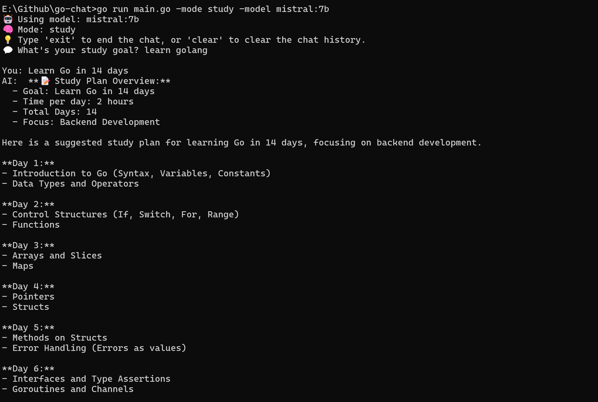
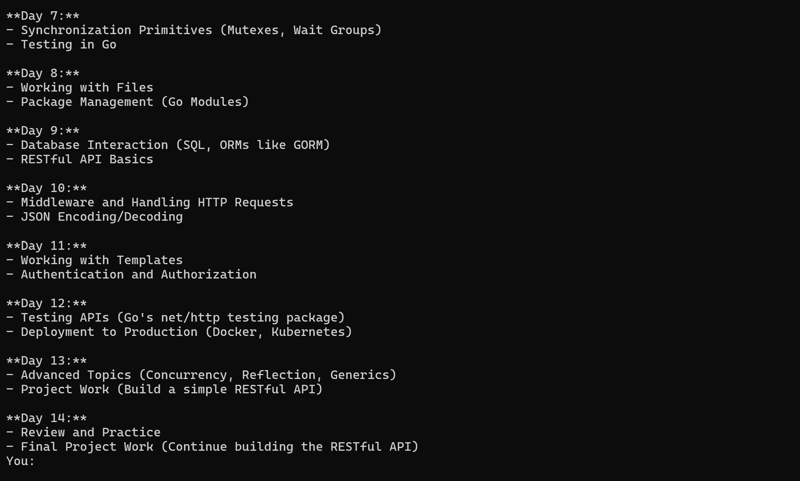

# LangChainGo Ollama Local LLM Chatting

## Overview

This application demonstrates using LangChainGo with Ollama to generate text for Go-backed LLM tools. It showcases local AI model interaction, streaming generation, and context-based content generation.

## Features

- Local AI Model generation with ollama(no OpenAI key needed)
- Streaming text output and content generation.
- Flexible system and user message configuration.
- Flag-driven CLI (`--mode`, `--pretty`, `--model`).
- Streamed LLM output.
- System prompts stored in YAML for easy editing.

## What It Does

- Accepts study goals (e.g., *"Learn Go in 14 days"*)
- Uses a selected mode (`study`, `exam_prep`, or `focus_mode`)
- Sends structured prompt to a local LLM
- Streams response or renders it prettily in the terminal

## Error Handling

- Check For Ollama initialization errors.
- Manages content generation errors.

## 🎯 Run It

```bash
go run main.go -mode study -model mistral:7b
```

### 📸 Screenshot



